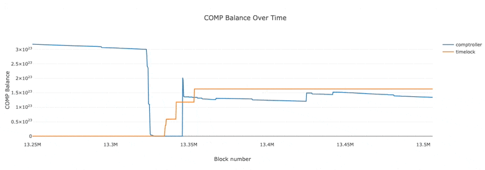

# TrueBlocks Plotter

_This is a work in progress_

## Usage

1. Install [TrueBlocks](https://github.com/TrueBlocks/trueblocks-core/) if you don't already have it
2. Install packages with `yarn`
3. Run `cp .env.template .env`
4. Run `ANALYSIS_NAME=analysisName yarn start`
5. The plot will open in a browser window

You can run `ANALYSIS_NAME=example yarn start` to see an example

## Example

Below is the sample config file in `example.config.ts`, heavily annotated with comments to explain how this tool works

```typescript
import { QueryConfig } from '../src/types';
import { ethers } from 'ethers';

// Using the ethers.js human-readable ABI format, we define the functions we'll
// be querying. Note that importing ABIs from a JSON file in also valid
const abi = ['function balanceOf(address account) external view returns (uint256)'];

// Generate an Interface class instance from the abi (`interface` is a reserved
// keyword, which is why we use the variable name `iface`)
const iface = new ethers.utils.Interface(abi);

// Define addresses we'll be referencing in our commands
const comp = '0xc00e94Cb662C3520282E6f5717214004A7f26888'; // COMP address
const comptroller = '0x3d9819210A31b4961b30EF54bE2aeD79B9c9Cd3B'; // Compound comptroller address
const timelock = '0x6d903f6003cca6255D85CcA4D3B5E5146dC33925'; // Compound timelock

// This is the main configuration object
export const config: QueryConfig = {
  // Define the start block, end block, and interval to query. For example,
  // entering 12000000, 13000000, and 1000 will fetch data for every 1000
  // blocks between blocks 12000000 and 13000000
  blocks: {
    start: 13250000,
    end: 13506114,
    interval: 277, // 277 blocks per hour at 13 seconds per block
  },
  // Each item in this `queries` array is converted to a chifra command to execute
  // at each block in the range of blocks specified above. The `plot` object is
  // used to configure plot settings and is passed directly to Plotly
  queries: [
    {
      // Address to call
      target: comp,
      // ABI-encoded calldata to call on `target`
      calldata: iface.encodeFunctionData('balanceOf', [comptroller]),
      // When `cache` is true, the queries are cached to speed up subsequent runs.
      // This takes up extra hard drive space but offers significant performance
      // improvements for large queries. Defaults to true if not specified
      cache: false,
      // See plotly.js docs or the `PlotData` interface in
      // `node_modules/@types/plotly.js/index.d.ts` for supported options
      // https://plotly.com/javascript/
      plot: {
        name: 'comptroller',
      },
    },
    {
      target: comp,
      calldata: iface.encodeFunctionData('balanceOf', [timelock]),
      cache: false,
      plot: {
        name: 'timelock',
      },
    },
  ],
  // See plotly.js docs or the `Layout` interface in
  // `node_modules/@types/plotly.js/index.d.ts` for supported options
  // https://plotly.com/javascript/
  plotLayout: {
    title: 'COMP Balance Over Time',
    xaxis: { title: 'Block number' },
    yaxis: { title: 'COMP Balance' },
  },
};
```

Because this file is named `example.config.ts`, we run it with the command below:

```sh
ANALYSIS_NAME=example yarn start
```

This will open an interactive plot in your browser window, as shown below

[](assets/example.gif)

